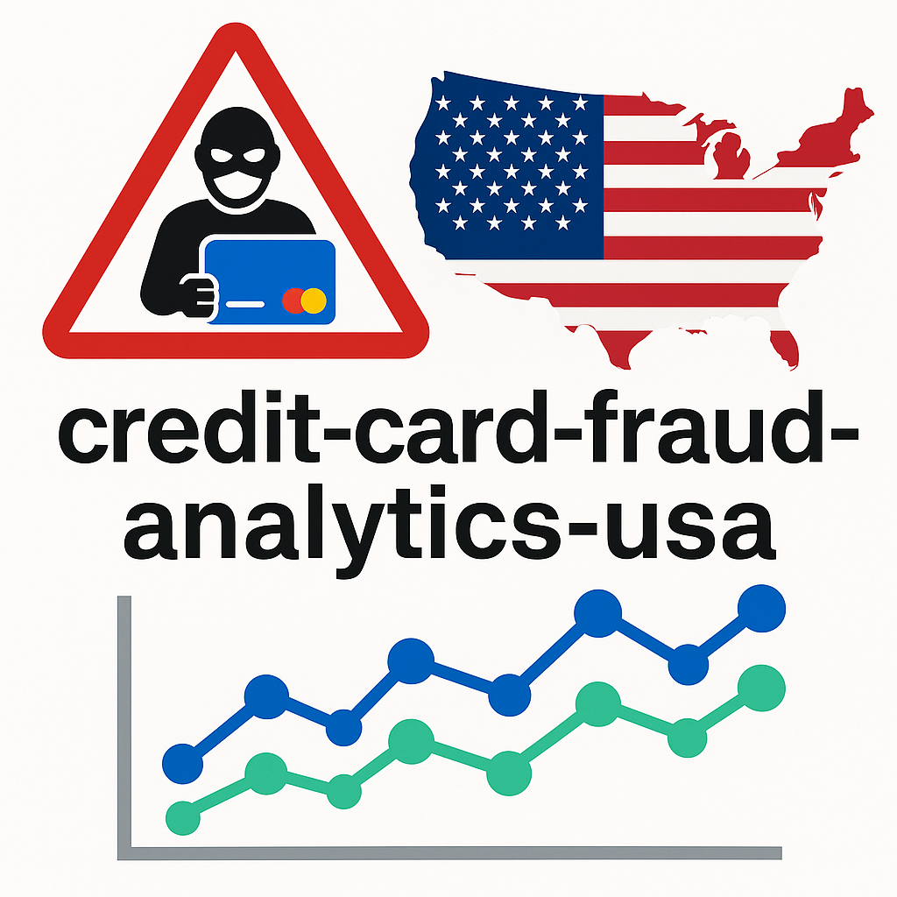

  

# credit-card-fraud-analytics-usa

Advanced SQL-driven fraud analytics project leveraging U.S. fraud report data to uncover financial crime hotspots, loss patterns, and emerging risks. Designed to support research in fraud prevention, data science, and national security.

---

## 📌 Project Overview
This project analyzes nationwide U.S. fraud reports with a focus on **credit card fraud** and related financial crimes. Using SQL queries, the analysis highlights:
- State-level fraud hotspots  
- Loss amounts and average loss per victim  
- Year-over-year fraud trends  
- Subtype patterns and emerging risks  

The goal is to generate insights that can **strengthen fraud detection systems**, reduce economic losses, and contribute to **public safety**.

---

## 📊 Dataset
The dataset (`fraud_reports.xlsx`) includes fraud statistics by:
- **State**  
- **Theft Type & Subtype** (e.g., Credit Card, Bank Account, ID Theft)  
- **Number of Reports**  
- **Total $ Loss**  
- **Median $ Loss**  
- **% Difference From Previous Year**  

---

## 🛠️ SQL Analysis
The SQL script (`Fraud Detection Analysis.sql`) contains queries to answer key questions:
1. Total $ loss per state (for specific fraud types)  
2. Top fraud subtypes by number of reports  
3. Average loss per victim nationwide  
4. States with highest loss per report  
5. Subtypes with increasing vs. declining trends  
6. Integrity checks on reported data  

---

## 🔑 Key Insights
- **High-loss states** reveal concentrated financial crime risks  
- **Credit card fraud** remains one of the most costly subtypes  
- **Year-over-year analysis** detects both growing and declining fraud patterns  
- **Loss per report** helps evaluate the economic burden of fraud at both national and state levels  

---

## 🌍 Relevance to U.S. National Interest
Fraud and financial crime cost the U.S. economy **billions of dollars annually**.  
This project demonstrates the use of **data analytics** and **SQL-driven insights** to:
- Detect fraud patterns early  
- Identify high-risk regions and fraud subtypes  
- Inform policymakers, researchers, and financial institutions  

By enhancing fraud detection and prevention strategies, this work contributes directly to the **economic stability and national security** of the United States.  

---

## 🚀 How to Use
1. Clone the repository  
2. Import the dataset (`fraud_reports.xlsx`) into your SQL environment  
3. Run queries from `Fraud Detection Analysis.sql`  
4. Extend queries to build machine learning or visualization models  

---

## 📚 Future Work
- Integrating **machine learning models** for fraud prediction  
- Building **dashboards** for real-time fraud monitoring  
- Expanding dataset coverage with more recent reports  

---

## 📜 License
This project is licensed under the MIT License – feel free to use and build upon it.  
